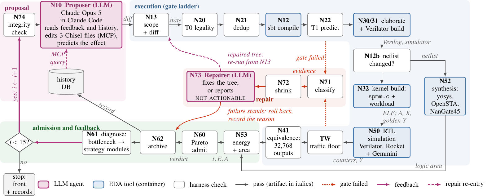
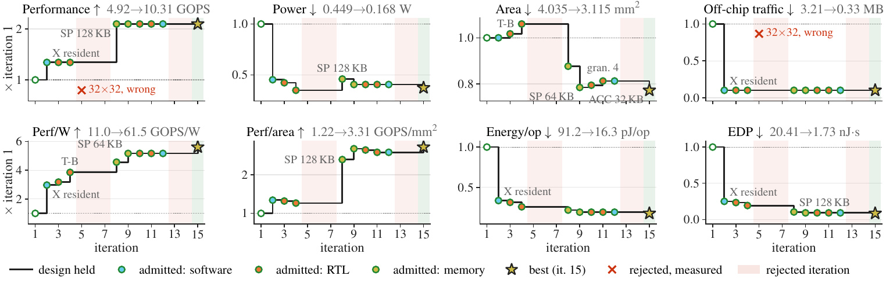

# SparseCraft: Agentic Hardware–Software Co-Optimization for Sparse Computing

**Submission to the [CHIA](https://chialoops.ai) Hackathon 2026.**

**Authors:** Rajatabha Chakraborty, M P Samartha, Vedant Pahariya, Priyesh Shukla
International Institute of Information Technology, Hyderabad, India 

---

## Introduction

Sparse-accelerator design spaces are usually searched against analytical
models, so a design point is admitted on what a model predicts rather than on
what the hardware does. **SparseCraft closes that gap by placing a language
model inside a closed CHIA loop.** In every iteration the model reads the
measured outcome of the previous one and edits the Chisel RTL, the memory
configuration and the sparse-kernel schedule of a
[Gemmini](https://github.com/ucb-bar/gemmini) systolic-array accelerator.
No candidate counts until the harness has checked it for legality, compiled
and elaborated it, simulated it cycle-accurately, checked every one of its
outputs bit-for-bit against a golden reference, and synthesised it.

**Key results.** On a 512×512 layer of the GraphChallenge sparse DNN, 15
iterations took the block-sparse Gemmini baseline to:

- **2.10× fewer cycles** and **9.8× less off-chip traffic** (measured in RTL simulation)
- **22.8% less area** (synthesised logic plus estimated SRAM)
- **5.61× higher perf/W** and **11.8× lower energy-delay product** (energy modelled from measured counters)
- **0 wrong outputs**: every admitted design matches the golden result on all 32,768 outputs

**Key innovations.**

- **The LLM is inside the loop.** Claude Opus 5, run as a sealed Claude Code
  agent, proposed all 14 design changes of the run from measured feedback; no
  human proposed, edited or selected a design.
- **Cross-stack co-design.** One typed design state spans the software kernel
  schedule, the memory hierarchy and the RTL. The agent optimised all three: it
  kept the dense operand resident in the scratchpad (software), wrote a
  zero-gated MAC and a zero-row skip unit in Chisel (RTL), and resized the
  scratchpad and accumulator (memory).
- **Measured, not predicted.** A gate ladder builds, simulates, checks and
  synthesises every candidate, and the scoring code is hashed every iteration
  so the agent cannot change how it is judged.
- **Structured feedback and repair.** Each iteration's work order carries the
  diagnosed bottleneck with matching strategy guidance, the history of tried
  designs and a score of the agent's own prediction; a second agent repairs
  changes that fail a gate.

---

## Architecture: the SparseCraft CHIA loop



*Purple nodes are LLM agents, blue nodes are EDA tool runs in containers, and
white nodes are programmatic harness checks. Node IDs match `src/loop.py`.*

One iteration runs through four stages:

1. **Proposal.** An integrity check (N74) confirms that the legality rules,
   Pareto admission, energy model, metrics parser and kernel still hash to
   their recorded values. The proposer (N10) then edits the design. It is
   Claude Code with every built-in tool removed, so its only actions are three
   MCP tools served by CHIA: a bash tool inside the Chipyard build container,
   restricted to three writable files (design parameters, `PE.scala`, the
   zero-bitmap unit), a status tool and a history tool.
2. **Execution (the gate ladder).** Scope check (N13), legality in
   microseconds (N20, 27 rules plus a pinned benchmark), dedup (N21), compile
   (N12), analytic prediction (N22), Chisel elaboration and Verilator build
   (N30/31), netlist-changed check (N12b), kernel build (N32), cycle-accurate
   RTL simulation of a Rocket core with Gemmini (N50), a traffic tripwire, and
   bit-exact equivalence on all 32,768 outputs (N41). Synthesis with yosys and
   OpenSTA on NanGate45 (N52) runs in parallel with the simulation.
3. **Repair.** A failed gate is classified (N71), its evidence shrunk (N72),
   and a second agent (N73) either fixes the tree, which re-runs the whole
   ladder, or reports the failure not actionable with a root cause. Up to three
   attempts per iteration.
4. **Admission and feedback.** Energy and area are computed (N53), the design
   is admitted if it is Pareto non-dominated in time, energy and area (N60) and
   archived (N62), and the diagnosis (N61) turns the measured counters into the
   next work order. An admitted design becomes the next parent; a rejected one
   is rolled back exactly. The loop stops after 15 iterations.

**Prompts are structured for step-by-step reasoning.** System prompts are
composed from shared fragments (writable set, execution rules, feedback
schema, output contract). Each work order gives, in order, the parent design,
the measured diagnosis and counters, the strategy modules for the diagnosed
bottleneck, a numbered procedure and the agent's untried candidates. The
answer must end in three parsed sections: candidates, the one mutation
implemented, and a better/flat/worse prediction for time, energy, area and
clock, which the harness scores against the measurement. See
[docs/architecture.md](docs/architecture.md) for details.

---

## Results



*Every metric normalised to iteration 1 (the baseline). The black step line is
the design the loop held after each iteration; markers are admitted designs,
coloured by the layer they changed; red bands are rejected iterations.*

| metric | baseline (it. 1) | SparseCraft (it. 15) | improvement |
|---|---:|---:|---:|
| cycles (measured) | 106,650 | 50,862 | **2.10× fewer** |
| off-chip bytes (measured) | 3,211,264 | 327,680 | **9.8× less** |
| area, mm² (logic measured, SRAM estimated) | 4.035 | 3.115 | **22.8% smaller** |
| energy, µJ (modelled) | 95.67 | 17.04 | **5.61× less** |
| power, W (modelled) | 0.449 | 0.168 | **2.68× less** |
| performance, GOPS | 4.92 | 10.31 | **2.10×** |
| perf/W, GOPS/W | 10.96 | 61.5 | **5.61×** |
| perf/area, GOPS/mm² | 1.22 | 3.31 | **2.72×** |
| energy-delay product, nJ·s | 20.41 | 1.73 | **11.8× less** |
| wrong outputs | 0 | 0 | |

How the agent got there, one layer at a time:

- **Software schedule (iteration 2):** keeping all of the dense operand
  resident in the scratchpad cut off-chip traffic 9.8× and cycles 1.34×, at
  zero area.
- **RTL written by the agent (iterations 3 and 4):** a zero-gated MAC cut
  energy 6.6% and a zero-row skip unit cut it a further 17.5%.
- **Memory sizing (iterations 8, 9 and 15):** shrinking the scratchpad from 256
  to 64 KB and the accumulator from 64 to 32 KB cut area, and the first
  scratchpad halving also cut cycles by 36%.

The run records every iteration: design state, RTL diff, agent transcript,
counters, synthesis report and the CHIA profile log, in
[results/v2-final15](results/v2-final15). [docs/results.md](docs/results.md)
walks through all 15 iterations. Our first loop is kept on branch
[`archive/v1-first-loop`](https://github.com/RAJATABHA2201/chia_hackathon_2026/tree/archive/v1-first-loop),
with its run in [results/v1-final15](results/v1-final15).

---

## Reproducing SparseCraft

### Requirements

- **Host:** Linux x86-64 with podman or docker. Our host had 64 hardware
  threads and 62 GB of RAM; a Chisel elaboration alone can take 8 to 12 GB.
  Budget tens of GB of disk for the container images.
- **Conda** (Miniforge or Miniconda) for the CHIA environment.
- **[CHIA](https://github.com/ucb-bar/chia)**, which pins Python 3.10 and Ray
  2.54 ([documentation](https://docs.chialoops.ai)).
- **Container images:** `ghcr.io/ucb-bar/chia-chisel-build` (Chipyard,
  Gemmini, Chisel, Verilator; about 16 GB), `ghcr.io/ucb-bar/chia-verilator-run`,
  `ghcr.io/ucb-bar/chia-riscv-cross`, and the synthesis image
  `localhost/sparsecraft-synth`, built from [docker/](docker/).
- **The Claude Code CLI**, logged in once (`claude`). The loop uses model
  `claude-opus-5`; no API key is needed when the CLI is logged in.

### 1. Clone

```bash
git clone https://github.com/RAJATABHA2201/chia_hackathon_2026.git
cd chia_hackathon_2026
```

### 2. Install CHIA

```bash
conda create -n chia_env python=3.10 -y
conda activate chia_env
git clone https://github.com/ucb-bar/chia.git ../chia
pip install -e ../chia            # follow CHIA's docs if your setup differs
```

CHIA starts its workers with the `docker` command. On a podman-only host, put
a shim on your `PATH` first:

```bash
mkdir -p ~/bin && ln -sf "$(command -v podman)" ~/bin/docker
export PATH="$HOME/bin:$PATH"
```

### 3. Pull and build the container images

```bash
docker pull ghcr.io/ucb-bar/chia-chisel-build:latest
docker pull ghcr.io/ucb-bar/chia-verilator-run:latest
docker pull ghcr.io/ucb-bar/chia-riscv-cross:latest
docker/build.sh                   # builds localhost/sparsecraft-synth:latest
```

With podman, set `TMPDIR` to a directory on a large disk before pulling, since
image layers are staged there.

### 4. Log in to Claude Code

```bash
claude                            # once, interactively
```

### 5. Preflight

```bash
python scripts/check_setup.py --quick   # every image and Ray resource reachable?
python scripts/check_llm.py             # can the loop reach the model?
```

### 6. Run the loop

`scripts/run.sh` brings the CHIA cluster up (`configs/cluster.yaml`), runs the
loop, and tears the cluster down even if the run fails. To repeat our final
run (15 iterations with synthesis, effort `high` for both agents):

```bash
export SPARSECRAFT_CLAUDE_EFFORT=high SPARSECRAFT_REPAIR_EFFORT=high
scripts/run.sh --iters 15 --synth -- --run-name my-run
```

Each iteration takes about 22 minutes on our host, so 15 iterations take about
5.5 hours. Records go to `runs/my-run/`. To continue a run that was stopped,
repeat the command with `--resume` after `--run-name my-run`.

### 7. Inspect and reproduce the results

```bash
python scripts/report_iter.py my-run    # per-iteration report of your run
python scripts/summarize_runs.py        # regenerate results/summary/ from the published records
```

`summarize_runs.py` needs no cluster: it recomputes the cycles, off-chip
traffic, area, energy and perf/W in the table above from
[results/v2-final15](results/v2-final15). The unit tests,
including a mock-cluster test of the whole loop, also run without a cluster:

```bash
for t in tests/test_*.py; do python "$t"; done
```

### Repository layout

```
src/        the loop: driver, CHIA nodes, agent backends, models, legality, repair
scripts/    run.sh, preflight checks, reports, result summaries
configs/    CHIA cluster and cache configuration
prompts/    system prompts, work orders, shared fragments, strategy modules,
            and the repairer's debugging references
kernels/    spmm.c: the block-sparse SpMM kernel and golden check (immutable to the agent)
workload/   matrix preparation and the generated workload headers
docker/     the synthesis image (yosys, OpenSTA, NanGate45)
tests/      unit tests and a mock-cluster test of the whole loop
docs/       architecture, results, change log, README figures
results/    published run records and generated summaries
archive/    superseded prompts, kept for provenance
```

---

## Conclusion

SparseCraft shows that a language model placed inside a closed CHIA loop can
co-optimise a sparse accelerator across its software kernel, memory hierarchy
and RTL, reaching 2.10× fewer cycles, 22.8% less area and 5.61× higher perf/W
over a block-sparse Gemmini baseline, with every design built, simulated,
verified on every output and synthesised before it counted.
