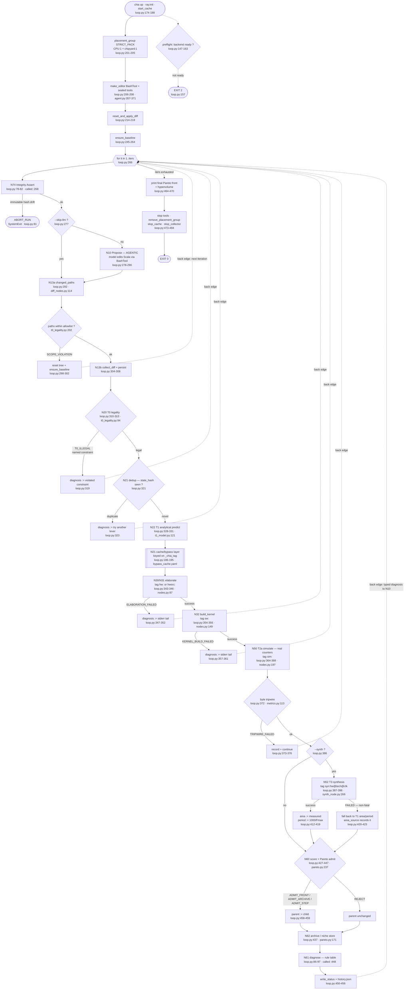

# SparseCraft CHIA Loop — Current State

Ground truth as of 2026-09-16. Every claim below cites `file:line`. The
reference specification is `SparseCraft_Technical_Review.md` §3.1–§3.2 (the
"Loop v2" directed-graph spec); the implementation is `sparsecraft/loop.py`
plus the node modules it imports.

Scope note: this describes what the code *does*, not what it should do. The
gaps section is deliberately blunt.

---

## 1. The loop as implemented

---

## 2. Node inventory

| Node | Source `file:lines` | Consumes | Emits | Status |
|---|---|---|---|---|
| **N74** Integrity Assert | `loop.py:68-82`, called `:268` | `IMMUTABLE_FILES` hashes + `weights_hash()` | ok \| `ABORT_RUN` | **implemented** |
| **N10** Propose Candidates | `loop.py:278-290`; `agent.py:254-297`, `:357-364` | rendered `task.md` (parent state, diagnosis) | Scala edits written in-container via `BashTool` | **implemented** (K=1, not K≥3) |
| **N11** Select Candidate | — | — | — | **missing** |
| **N12** Emit Patch | — | — | — | **missing** (model writes tree directly) |
| **N13** Patch Scope + Apply | `loop.py:292-308`; `t0_legality.py:202-220`; `diff_nodes.py:114-133`, `:29-62` | `git status` paths, allowlist, `harness_paths` | `diff_NNN.json` \| `SCOPE_VIOLATION` | **implemented** |
| **N20** T0 Legality | `loop.py:310-320`; `t0_legality.py:94-190` | `DesignState` | `Verdict(legal, violations)` | **implemented** |
| **N21** Hash + Cache/Dedup | `loop.py:186-195`, `:321-325`; `bypass_cache.yaml` | `state_hash`, `_chia_tag` | cache hit \| novel \| duplicate | **implemented** |
| **N22** T1 Analytical Model | `loop.py:328-331`; `t1_model.py:121-194` | `DesignState`, `Workload` | `Prediction` (cycles/area/energy/`bound_by`) | **implemented** as a *predictor*; **stubbed** as a *filter* |
| **N23** δ-Calibration | — (referenced `t1_model.py:12,46,200`) | — | — | **missing** |
| **N24** Fan-out / Gather | — | — | — | **missing** |
| **N30** Chisel Elaborate | `loop.py:343-352`; `nodes.py:87-147` | design state JSON, `collect_src` | `BuildArtifact` (+ generated SV) | **implemented** |
| **N31** Verilator Build | fused into N30 — `nodes.py:87-147` | — | simulator binary | **implemented but fused** (no separate `sv_hash` key) |
| **N32** Software Build | `loop.py:354-361`; `nodes.py:149-195` | kernel C source, design state | compiled test binary | **implemented** |
| **N40** Exact Equivalence | — | — | — | **missing** |
| **N41** Numerical Tolerance | — | — | — | **missing** |
| **N50** T2a Functional Sim | `loop.py:364-368`; `nodes.py:197-251` | artifact + kernel | Gemmini counters via `metrics.parse` | **implemented** |
| **N51** T2b Long-sequence | — | — | — | **missing** |
| **N52** T3 Synthesis | `loop.py:377-424`; `synth_node.py:266-466` | generated SV, tech, clock target | area, cells, WNS, Fmax | **implemented** (synchronous, not async future) |
| **N60** Score + Pareto Admit | `loop.py:427-447`; `pareto.py:237-` | `Point(t,E,A,sram)`, front, archive | `ADMIT_FRONT/ARCHIVE/STEP` \| `REJECT` | **implemented** |
| **N61** Diagnose | `loop.py:86-97`, called `:448` | `Metrics` | bottleneck label + lever hint | **partial** — rule table only; no agentic escalation on `unclassified` |
| **N62** Archive / Niche Store | `loop.py:437`; `pareto.py:171-193` | admitted point + descriptor | niche-best map | **implemented** |
| **N70** Gate Self-Test (canary) | — | — | — | **missing** |
| **N71** Error Classifier | — | — | — | **missing** (failures handled inline as diagnosis strings) |
| **N72** Failure Shrinker | — | — | — | **missing** |
| **N73** Repair Agent | — (named in `agent.py:1` docstring only) | — | — | **missing** |
| **N75** Stagnation Monitor | — | — | — | **missing** |
| **N00** Workload Profile | `loop.py:172` instantiates static `Workload()` (`t1_model.py:50`) | — | static constants, not a profile | **missing** as a node |
| **N01** Baseline Characterise | `loop.py:434-438` sets `base_point` inside iteration 1 | first measured point | baseline vector | **partial** — not a cached pre-loop node |
| **N80** Holdout Evaluation | — | — | — | **missing** |
| **N81** T4 P&R + Power | — | — | — | **missing** |

**Agentic pull tools** (spec §3.2 lists five):

| Tool | Source | Status |
|---|---|---|
| `query_history(filter, top_k)` | `agent.py:348` | **implemented** |
| `get_pareto_front()` | `agent.py:352` | **implemented** |
| `read_status()` | `agent.py:319` | **implemented** (not in spec — an addition) |
| `compare(state_a, state_b)` | — | **missing** |
| `query_density(region, gran)` | — | **missing** |
| `query_profile(counter, iter)` | — | **missing** |

---

## 3. Gaps

### 3a. In the spec, absent from code (16 of 30 nodes)

Ranked by consequence, not by node number.

1. **N41 Numerical Tolerance / N40 Exact Equivalence — nothing verifies correctness.**
   The loop admits designs to the Pareto front on `t`, `E`, `A`, `sram_bytes`
   (`loop.py:427-433`) with no accuracy term. `pareto.py:85` `feasible()` takes a
   `q_min` argument, so the *signature* anticipates an accuracy objective, but no
   node ever produces `q`. The only correctness-adjacent guard in the whole loop
   is the byte tripwire (`loop.py:372`), which detects a design that stopped
   reading its inputs — not one that computes the wrong answer. **A design that
   silently corrupts attention output is admissible today.** This is the single
   highest-consequence gap.

2. **N70 Gate Self-Test — nothing detects a weakened gate.** Spec §2.5 Gap 2
   exists specifically to catch the failure where the admission predicate itself
   degrades. Not implemented, so a scoring regression is undetectable from inside
   a run.

3. **N71/N72/N73 the repair lane.** Every failure path
   (`loop.py:298`, `:317`, `:347`, `:357`, `:373`) does the same thing: write a
   record, set a diagnosis string, `continue`. There is no error classification,
   no failing-case minimisation, and no repair agent. `agent.py:1` advertises
   "N10/N73" in its module docstring but only N10 exists — the docstring is
   ahead of the code.

4. **N11/N12/N24 the fan-out lane.** The spec's search policy (propose K≥3,
   select programmatically, dispatch in parallel) is absent; the loop is strictly
   K=1 serial. N12's purpose was to remove the agent's write path to the tree —
   the implementation instead keeps the direct `BashTool` write path and
   compensates with the N13 allowlist after the fact. That is a defensible
   trade, but it is a deviation from the spec, not an implementation of it.

5. **N51 T2b long-sequence.** Only the 256-token T2a slice runs. Spec §2.3
   Finding 2 argues that tier cannot observe the length-dependent phenomena the
   project targets, which means the loop currently optimises against a proxy the
   review already flagged as insufficient.

6. **N23 δ-calibration.** `t1_model.py:46` hardcodes `DELTA_UNCALIBRATED = 0.35`
   and `:200` documents it as provisional "until N23 measures delta". The T1
   filter therefore runs on an uncalibrated slack indefinitely.

7. **N75 stagnation / N80 holdout / N81 T4 / N00 workload profile / N01 baseline.**
   All post-loop or pre-loop infrastructure; absent but lower urgency.

Also note **N22 is a predictor but not a filter**: `t1_model.py:196`
`dominates_with_slack()` is defined and never called from `loop.py`. The
prediction is recorded (`loop.py:329`) and then every candidate proceeds to a
full elaboration regardless. The spec's entire rationale for N22 was to *avoid*
paying for predicted-dominated candidates — that saving is not being realised.

### 3b. In the code, absent from the spec

1. **Byte tripwire** — `loop.py:370-375` + `metrics.py:113`. A reward-hacking
   guard asserting the design still reads at least `seq_len × d_head × 3` bytes.
   Sound, and arguably belongs in the spec's §2.5 guardrail set, but it is
   undocumented there.

2. **`ensure_baseline()` + `harness_paths`** — `loop.py:245-264`. Seeds
   `SparseCraftParams.scala` + the harness config when the tree lacks them, and
   records those paths so N13 can distinguish harness scaffolding from a model
   edit (`t0_legality.py:202-213`). Necessary for iteration zero and for
   `--skip-llm`; no spec node covers it.

3. **T3 graceful degradation** — `loop.py:412-423`. On synthesis failure the
   iteration falls back to T1's predicted area/period and records `area_source`.
   The spec models N52 as an async future that updates the front late; the
   implementation is synchronous with a documented fallback. Different design,
   arguably better for a single-host run, but a deviation.

4. **`read_status()` sealed tool** — `agent.py:304-325`, fed by
   `write_status()` (`loop.py:100-111`). A harness-recomputed status surface the
   model can pull. Not among the spec's five pull tools.

5. **`--skip-llm` harness-only mode** — `loop.py:120-122`. Runs the full
   evaluation pipeline against the current tree with no agentic turn. Essential
   for testing; not a spec concept.

### 3c. Summary counts

- Spec nodes: **30**
- Implemented (incl. 1 fused, 2 partial): **14**
- Missing: **16**
- Undocumented additions in code: **5**
- Agentic pull tools: **2 of 5** implemented, **1** added
